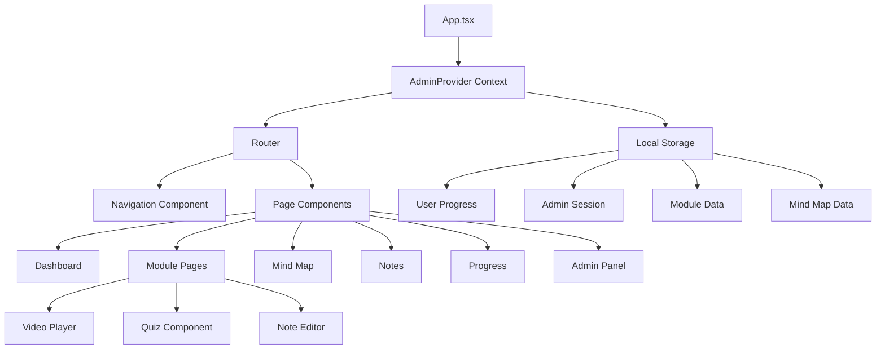

# Jung Educational App - Architecture Overview

## Project Overview

The Jung Educational App (jaqEdu) is a modern, interactive educational platform designed to teach Carl Jung's Analytical Psychology concepts. Built with React and TypeScript, it provides a structured learning experience with modules, progress tracking, and administrative capabilities.

## Technology Stack

### Frontend Framework
- **React 18.2.0** - Component-based UI framework
- **TypeScript 4.9.5** - Type-safe JavaScript
- **React Router 6.21.0** - Client-side routing
- **Tailwind CSS 3.4.0** - Utility-first CSS framework

### Key Libraries
- **React Flow 11.11.4** - Interactive mind map visualization
- **React YouTube 10.1.0** - YouTube video integration
- **Lucide React 0.395.0** - Modern icon library
- **PostCSS & Autoprefixer** - CSS processing

### Development Tools
- **Create React App** - Build configuration
- **Jest & Testing Library** - Unit and integration testing
- **Claude Flow** - AI-powered development coordination

## Architecture Design

### Component Architecture

```
jung-edu-app/
├── src/
│   ├── App.tsx                 # Main application entry point
│   ├── components/             # Reusable UI components
│   │   ├── Navigation.tsx      # Global navigation
│   │   ├── ProtectedRoute.tsx  # Route authentication guard
│   │   ├── admin/              # Admin-specific components
│   │   ├── modules/            # Module-related components
│   │   ├── notes/              # Note-taking components
│   │   ├── quiz/               # Quiz components
│   │   └── __tests__/          # Component tests
│   ├── contexts/               # React Context providers
│   │   └── AdminContext.tsx    # Admin authentication & state
│   ├── data/                   # Static data and configurations
│   │   ├── modules.ts          # Course module definitions
│   │   └── mindmap.ts          # Mind map node/edge data
│   ├── pages/                  # Route-level components
│   │   ├── Dashboard.tsx       # Main user dashboard
│   │   ├── ModulePage.tsx      # Individual module view
│   │   ├── MindMapPage.tsx     # Interactive concept map
│   │   ├── NotesPage.tsx       # Personal notes management
│   │   ├── ProgressPage.tsx    # Learning progress tracker
│   │   ├── SearchPage.tsx      # Content search
│   │   ├── BibliographyPage.tsx # Resource bibliography
│   │   └── admin/              # Admin panel pages
│   ├── types/                  # TypeScript type definitions
│   │   └── index.ts            # Centralized type exports
│   └── hooks/                  # Custom React hooks
```

### Data Flow Architecture



## Core Features

### 1. Educational Modules System
- **Structured Learning Path**: Modules with prerequisites, difficulty levels, and time estimates
- **Rich Content Types**: Text sections, videos, quizzes, key terms, and images
- **Progress Tracking**: Automatic tracking of completed modules and quiz scores

### 2. Interactive Mind Map
- **Visual Learning**: React Flow-based interactive concept visualization
- **Node Relationships**: Shows connections between Jungian concepts
- **Customizable**: Admin can modify nodes and edges

### 3. Personal Notes System
- **Module-Linked Notes**: Notes associated with specific modules
- **Tagging System**: Organize notes with custom tags
- **Persistent Storage**: Notes saved in local storage

### 4. Progress Tracking
- **Completion Metrics**: Track module completion percentage
- **Time Tracking**: Monitor study time per module
- **Quiz Performance**: Store and display quiz scores

### 5. Admin Panel
- **Content Management**: Edit modules, quizzes, and resources
- **Mind Map Editor**: Visual editor for concept relationships
- **Resource Management**: Manage bibliography and film references

## State Management

### Local State
- Component-level state using React hooks (useState, useEffect)
- Form state management in admin editors

### Global State
- **AdminContext**: Manages admin authentication and content editing
- **UserProgress**: Stored in App component, passed via props

### Persistence
- **LocalStorage**: Used for all data persistence
  - User progress and notes
  - Admin session
  - Module customizations
  - Mind map configurations

## Security Considerations

### Authentication
- Basic admin authentication (username/password)
- Session persistence via localStorage
- Protected routes using ProtectedRoute component

### Data Validation
- TypeScript type checking at compile time
- Form validation in admin editors
- Input sanitization for user-generated content

## Performance Optimization

### Code Splitting
- React Router enables route-based code splitting
- Lazy loading for admin panel components

### Asset Optimization
- YouTube videos loaded on-demand
- CSS optimized with Tailwind's purge feature
- Image lazy loading for module content

### Caching Strategy
- LocalStorage caching for user data
- Module data cached after first load
- Progress updates batched to reduce writes

## Testing Architecture

### Unit Testing
- Component testing with React Testing Library
- Hook testing for custom hooks
- Utility function testing

### Integration Testing
- Page-level component integration tests
- Navigation flow testing
- State management testing

### Coverage Requirements
- 70% minimum coverage for all metrics
- Automated coverage reports with Jest

## Development Workflow

### Claude Flow Integration
- AI-powered swarm coordination
- Parallel task execution
- Automated code formatting and optimization
- Cross-session memory for development context

### Build Process
1. TypeScript compilation
2. CSS processing with PostCSS
3. Bundle optimization with Create React App
4. Production build with minification

## Deployment Considerations

### Static Hosting
- Single-page application suitable for static hosting
- Client-side routing requires server configuration
- Environment variables for API endpoints (future)

### Progressive Enhancement
- Works without JavaScript for basic content
- Enhanced interactivity with React hydration
- Responsive design for all devices

## Future Architecture Considerations

### Scalability
- Move from localStorage to backend API
- Implement proper user authentication system
- Add real-time collaboration features

### Performance
- Implement service workers for offline support
- Add server-side rendering for SEO
- Optimize bundle size with dynamic imports

### Features
- Multi-language support
- Advanced analytics and reporting
- Social learning features
- AI-powered content recommendations

## Conclusion

The Jung Educational App demonstrates a well-structured React application with clear separation of concerns, type safety, and a focus on user experience. The modular architecture allows for easy extension and maintenance while providing a rich, interactive learning platform for Jung's psychological concepts.