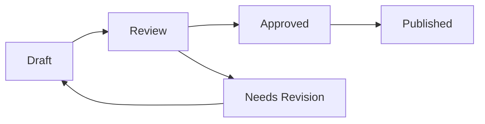

# 👨‍💼 jaqEdu Admin Guide

Comprehensive guide for administrators managing the jaqEdu educational platform.

## 🔑 Admin Access

### Default Admin Credentials

For initial setup and demo purposes:
- **Username**: `admin`
- **Password**: `jungadmin123`

⚠️ **Important**: Change these credentials immediately in production!

### Admin Roles and Permissions

| Role | Module Management | User Management | System Config | Analytics |
|------|------------------|-----------------|---------------|-----------|
| Super Admin | ✅ Full | ✅ Full | ✅ Full | ✅ Full |
| Admin | ✅ Full | ✅ Limited | ❌ No | ✅ View |
| Instructor | ✅ Own Content | ❌ No | ❌ No | ✅ Own |

## 📊 Admin Dashboard Overview

### Dashboard Sections

The admin dashboard provides comprehensive platform management:

```
Admin Dashboard
├── 📊 Statistics Overview
├── 📚 Module Management
├── 👥 User Management
├── 📖 Resources & Media
├── 🤖 AI Content Generation
├── 📈 Analytics & Reports
└── ⚙️ System Settings
```

### Key Metrics Display

- **Total Modules**: Active learning modules
- **Active Users**: Currently enrolled students
- **Completion Rate**: Average course completion
- **Engagement Score**: Platform interaction metrics

## 📚 Module Management

### Creating New Modules

#### Manual Module Creation

1. **Navigate to Module Management**
   ```
   Admin Dashboard → Gerenciar Módulos → Adicionar Novo
   ```

2. **Fill Module Information**
   - **Title**: Clear, descriptive title
   - **Description**: Brief overview (200-300 characters)
   - **Difficulty**: Beginner, Intermediate, or Advanced
   - **Duration**: Estimated completion time in minutes
   - **Prerequisites**: Required modules (if any)
   - **Tags**: Searchable keywords

3. **Add Module Content**
   ```typescript
   {
     "sections": [
       {
         "id": "intro",
         "title": "Introduction",
         "content": "Markdown content here...",
         "type": "text"
       }
     ],
     "glossary": {
       "term1": "Definition 1",
       "term2": "Definition 2"
     }
   }
   ```

4. **Configure Learning Objectives**
   - List 3-5 clear objectives
   - Use action verbs (understand, apply, analyze)
   - Align with module content

#### AI-Powered Module Generation

1. **Access AI Generator**
   ```
   Admin Dashboard → AI Module Generator
   ```

2. **Configure Generation Parameters**
   - **Topic**: Main subject matter
   - **Target Audience**: Student level
   - **Include Elements**:
     - ✅ Glossary
     - ✅ Examples
     - ✅ Quiz Questions
     - ✅ Video Suggestions
     - ✅ Bibliography

3. **Review and Edit Generated Content**
   - AI generates comprehensive module structure
   - Review for accuracy and relevance
   - Edit as needed before saving

4. **Enhance with Additional Resources**
   - Add curated videos
   - Include additional reading materials
   - Create custom quiz questions

### Module Publishing Workflow



1. **Draft Status**
   - Content being created/edited
   - Not visible to students
   - Can be previewed by admins

2. **Review Process**
   - Content validation
   - Fact-checking
   - Quality assurance

3. **Publishing**
   - Make module available to students
   - Set availability dates (optional)
   - Configure access restrictions

### Managing Existing Modules

#### Editing Modules

1. **Find Module**
   - Use search or filter by status
   - Click edit icon

2. **Update Content**
   - Modify sections
   - Update quiz questions
   - Refresh resources

3. **Version Control**
   - System tracks changes
   - Version history available
   - Rollback capability

#### Module Analytics

View detailed metrics for each module:
- **Enrollment Count**: Students who started
- **Completion Rate**: Percentage who finished
- **Average Time**: Time to complete
- **Quiz Performance**: Average scores
- **Engagement Metrics**: Views, interactions

## 👥 User Management

### User Administration

#### Viewing Users

```
Admin Dashboard → User Management
```

**User List Features**:
- Search by name, email, or username
- Filter by role, status, or activity
- Sort by registration date, last login
- Bulk actions available

#### User Details

Click on any user to view:
- **Profile Information**: Personal details
- **Learning Progress**: Module completion
- **Activity History**: Login times, actions
- **Notes & Submissions**: User-generated content

### Managing User Accounts

#### Creating Users

1. **Manual Creation**
   ```
   User Management → Add New User
   ```
   
2. **Required Information**
   - Email address
   - Username
   - First and last name
   - Role assignment
   - Initial password

3. **Optional Settings**
   - Language preference
   - Timezone
   - Email notifications
   - Special permissions

#### Modifying Users

**Available Actions**:
- Reset password
- Change role
- Update profile
- Suspend/activate account
- Delete account (with confirmation)

#### Bulk Operations

Select multiple users for:
- Role changes
- Email notifications
- Account activation/deactivation
- Progress reset
- Data export

### Role Management

#### Assigning Roles

1. **Student Role**
   - Default for new registrations
   - Access to published modules
   - Can track own progress
   - Create personal notes

2. **Instructor Role**
   - Create/edit own modules
   - View student progress
   - Grade assignments
   - Limited user management

3. **Admin Role**
   - Full module management
   - User administration
   - System configuration
   - Analytics access

## 📖 Resource Management

### Bibliography Management

#### Adding References

1. **Navigate to Resources**
   ```
   Admin Dashboard → Recursos e Mídia → Bibliografia
   ```

2. **Add New Reference**
   - **Title**: Book/article title
   - **Authors**: Array of author names
   - **Year**: Publication year
   - **Type**: Book, Article, Website, Video
   - **URL**: External link (optional)
   - **Description**: Brief summary

3. **Link to Modules**
   - Select associated modules
   - Set relevance level
   - Add context notes

### Video Resources

#### YouTube Integration

1. **Search for Videos**
   - Use built-in YouTube search
   - Filter by duration, date
   - Preview before adding

2. **Add Video to Module**
   - Copy video URL
   - Add custom title/description
   - Set playback options
   - Choose module placement

#### Video Management

- **Organize by Module**: Group related videos
- **Update Metadata**: Refresh titles/thumbnails
- **Monitor Availability**: Check for removed videos
- **Analytics**: View watch statistics

### Film Recommendations

Add educational films:
1. **Film Details**
   - Title and year
   - Director
   - Duration
   - Streaming availability

2. **Educational Context**
   - Relevance to Jung's concepts
   - Discussion points
   - Recommended modules

## 🤖 AI Features Administration

### Content Generation Settings

#### Configure AI Providers

```typescript
// AI Provider Configuration
{
  "defaultProvider": "openai",
  "providers": {
    "openai": {
      "model": "gpt-4o-mini",
      "temperature": 0.7,
      "maxTokens": 2000
    },
    "anthropic": {
      "model": "claude-3-sonnet",
      "temperature": 0.8
    }
  }
}
```

#### Generation Limits

Set usage limits:
- **Daily Generation Cap**: Max AI requests/day
- **Per-User Limits**: Individual quotas
- **Quality Thresholds**: Minimum scores
- **Content Filters**: Inappropriate content

### Quiz Generation

#### Automatic Quiz Creation

1. **Select Module Content**
2. **Configure Parameters**:
   - Question count (5-20)
   - Difficulty distribution
   - Question types mix
   - Time limits

3. **Review Generated Questions**
   - Verify accuracy
   - Check difficulty
   - Ensure clarity
   - Add explanations

#### Quiz Templates

Create reusable templates:
```javascript
{
  "template": "conceptual_understanding",
  "questionTypes": ["multiple_choice", "true_false"],
  "distribution": {
    "recall": 20,
    "understanding": 50,
    "application": 30
  }
}
```

## 📈 Analytics and Reporting

### Platform Analytics

#### Dashboard Metrics

**Real-time Statistics**:
- Active users (current)
- Module views (today)
- Quiz attempts (hourly)
- New registrations

**Historical Data**:
- User growth trends
- Completion rates over time
- Popular modules
- Engagement patterns

### Generating Reports

#### Standard Reports

1. **User Progress Report**
   - Individual progress
   - Cohort analysis
   - Completion predictions

2. **Module Performance**
   - Difficulty analysis
   - Time-to-complete
   - Drop-off points
   - Quiz success rates

3. **System Usage**
   - Peak usage times
   - Resource consumption
   - Error rates
   - Performance metrics

#### Custom Reports

Create custom queries:
```sql
-- Example: Students at risk
SELECT u.username, 
       COUNT(DISTINCT up.module_id) as started_modules,
       AVG(up.progress_percentage) as avg_progress
FROM users u
JOIN user_progress up ON u.id = up.user_id
WHERE up.last_accessed < NOW() - INTERVAL '14 days'
GROUP BY u.id
HAVING AVG(up.progress_percentage) < 50;
```

### Data Export

Export options:
- **CSV Format**: Spreadsheet analysis
- **JSON Format**: API integration
- **PDF Reports**: Presentation ready
- **Raw SQL**: Database dumps

## ⚙️ System Configuration

### Platform Settings

#### General Configuration

1. **Site Information**
   - Platform name
   - Description
   - Contact information
   - Support email

2. **Feature Toggles**
   - AI features on/off
   - Registration open/closed
   - Maintenance mode
   - Debug logging

3. **Localization**
   - Default language
   - Available languages
   - Date/time formats
   - Currency (if applicable)

#### Security Settings

1. **Authentication**
   - Password requirements
   - Session timeout
   - Max login attempts
   - 2FA configuration

2. **Access Control**
   - IP whitelisting
   - Role permissions
   - API rate limits
   - CORS settings

### Backup and Maintenance

#### Automated Backups

Configure backup schedule:
```yaml
backup:
  enabled: true
  schedule: "0 2 * * *"  # 2 AM daily
  retention: 30  # days
  types:
    - database
    - user_uploads
    - configurations
```

#### Maintenance Tasks

Regular maintenance checklist:
- [ ] Database optimization
- [ ] Clear old sessions
- [ ] Archive completed courses
- [ ] Update dependencies
- [ ] Security patches
- [ ] Performance monitoring

## 🚨 Troubleshooting Admin Issues

### Common Problems

#### Users Can't Access Modules

1. **Check Prerequisites**: Ensure requirements met
2. **Verify Publishing**: Module must be published
3. **Role Permissions**: Confirm user role
4. **Date Restrictions**: Check availability dates

#### AI Generation Fails

1. **API Key Valid**: Verify in settings
2. **Rate Limits**: Check usage quotas
3. **Content Length**: May be too long
4. **Network Issues**: Test connectivity

#### Performance Issues

1. **Check Metrics**: CPU, memory usage
2. **Database Queries**: Identify slow queries
3. **Cache Status**: Verify caching works
4. **CDN Function**: Check content delivery

### Admin Tools

#### Debug Mode

Enable for detailed logging:
```javascript
// In console
localStorage.setItem('debug', 'true');
window.location.reload();
```

#### System Health Check

Run diagnostic:
```bash
npm run admin:health-check
```

Output includes:
- Database connectivity
- API availability
- Storage usage
- Error rates
- Performance metrics

## 📋 Best Practices

### Content Management

1. **Regular Reviews**: Audit content quarterly
2. **Version Control**: Track all changes
3. **Quality Standards**: Maintain consistency
4. **User Feedback**: Incorporate suggestions
5. **Update Regularly**: Keep content current

### User Management

1. **Onboarding Process**: Welcome new users
2. **Regular Communication**: Update notifications
3. **Support Response**: 24-48 hour SLA
4. **Privacy Compliance**: Follow regulations
5. **Data Security**: Regular audits

### System Maintenance

1. **Scheduled Downtime**: Communicate in advance
2. **Backup Verification**: Test restore process
3. **Security Updates**: Apply promptly
4. **Performance Monitoring**: Daily checks
5. **Capacity Planning**: Monitor growth

## 🆘 Getting Admin Support

### Support Channels

1. **Documentation**: Check admin docs first
2. **Admin Forum**: Private admin community
3. **Direct Support**: admin-support@jaquedu.com
4. **Emergency**: Use urgent ticket system

### Reporting Issues

Include in reports:
- Admin username
- Browser/device info
- Steps to reproduce
- Error messages
- Screenshots
- Time of occurrence

---

*For technical implementation details, see the [Technical Documentation](./TECHNICAL_DOCUMENTATION.md) and [API Reference](./API_REFERENCE.md).*