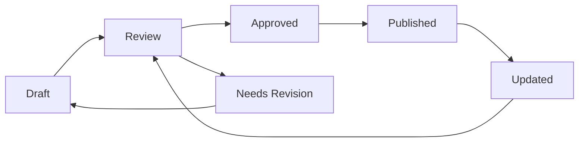

# 👨‍💼 jaqEdu Administrator Reference Guide

## 📋 Table of Contents

1. [Overview](#-overview)
2. [Authentication & Access](#-authentication--access)
3. [Admin System Architecture](#-admin-system-architecture)
4. [Dashboard Overview](#-dashboard-overview)
5. [Module Management](#-module-management)
6. [User Administration](#-user-administration)
7. [Resource Management](#-resource-management)
8. [AI Features Administration](#-ai-features-administration)
9. [Analytics & Reporting](#-analytics--reporting)
10. [System Configuration](#-system-configuration)
11. [Navigation & Workflow](#-navigation--workflow)
12. [Troubleshooting](#-troubleshooting)
13. [Security & Best Practices](#-security--best-practices)

## 🎯 Overview

The jaqEdu platform features a comprehensive administrative system that enables complete management of the educational platform. This unified guide combines technical implementation details with practical administration instructions.

### Administrative Capabilities

```
Administrative System
├── 🔐 Dual Authentication System
│   ├── Regular Users (Supabase Auth)
│   └── Admin Users (Enhanced Privileges)
├── 📊 Dashboard & Analytics
├── 📚 Module Management
│   ├── Manual Creation & Editing
│   ├── AI-Powered Generation
│   └── Publishing Workflow
├── 👥 User Administration
├── 📖 Resource Management
├── 🤖 AI Features Control
└── ⚙️ System Configuration
```

### Key Administrative Features

- **Complete Module Lifecycle Management**: Create, edit, publish, and archive educational content
- **Advanced User Management**: Role-based access control and user analytics
- **AI-Powered Content Generation**: Automated module and quiz creation
- **Real-time Analytics**: Platform usage, performance metrics, and reporting
- **Resource Management**: Bibliography, media, and external content organization
- **System Configuration**: Platform settings, security, and maintenance

## 🔐 Authentication & Access

### Admin Login System

The platform employs a dual authentication architecture for enhanced security:

#### Access Point
- **URL**: `http://localhost:3000/admin/login`
- **Production URL**: `https://yourdomain.com/admin/login`

#### Default Demo Credentials
- **Username**: `admin`
- **Password**: `jungadmin123`

⚠️ **Critical Security Note**: Change these credentials immediately in production environments!

### Authentication Process

1. **Navigate to Admin Login**: Access `/admin/login` endpoint
2. **Credential Validation**: System validates using SHA-256 hashing with salt
3. **Session Creation**: JWT session token generated with 24-hour expiry
4. **Token Storage**: Secure storage in localStorage
5. **Automatic Redirect**: Direct routing to `/admin/dashboard` for immediate access

### Security Features

- **Password Hashing**: SHA-256 with salt for credential protection
- **JWT Session Tokens**: 24-hour expiry with automatic refresh
- **Role-based Access Control**: Requires `UserRole.ADMIN` for access
- **Session Validation**: Automatic verification on page refresh
- **Login Attempt Limits**: Configurable lockout after failed attempts
- **Protected Route System**: Component-level access control

### Role Hierarchy & Permissions

| Role | Module Management | User Management | System Config | Analytics | Navigation |
|------|------------------|-----------------|---------------|-----------|------------|
| **Super Admin** | ✅ Full Access | ✅ Full Access | ✅ Full Access | ✅ Full Access | ✅ All Areas |
| **Admin** | ✅ Full Access | ✅ Limited Access | ❌ Read Only | ✅ View All | ✅ Most Areas |
| **Instructor** | ✅ Own Content | ❌ No Access | ❌ No Access | ✅ Own Data | ✅ Limited |

## 🏗️ Admin System Architecture

### Technical Implementation

#### Dual Authentication System
```typescript
// Admin authentication separate from regular users
interface AdminAuth {
  regularUsers: 'Supabase Auth',
  adminUsers: 'Enhanced Privileges + Separate Login'
}
```

#### Protected Route Implementation
```typescript
<ProtectedRoute requiredRole={UserRole.ADMIN}>
  <AdminComponent />
</ProtectedRoute>
```

#### Session Management
- **Session Duration**: 24 hours with automatic expiry
- **Token Refresh**: Automatic renewal before expiration  
- **Cross-tab Synchronization**: Session state maintained across browser tabs
- **Secure Storage**: JWT tokens stored securely with encryption

### Data Storage Architecture

#### Development Environment
- **localStorage**: Modules, mind maps, settings, and session data
- **Session Persistence**: Data maintained between browser sessions
- **Reset Capability**: Easy data clearing for testing and development

#### Production Environment
- **Supabase Database**: Primary data storage with full ACID compliance
- **Row Level Security (RLS)**: Database-level access protection
- **Real-time Synchronization**: Live updates across multiple admin sessions
- **Backup & Recovery**: Automated backup with point-in-time recovery
- **Audit Logging**: Complete action logging for security and compliance

### Integration Points

The admin system integrates with:
- **AuthContext**: Global authentication state management
- **AdminContext**: Admin-specific functionality and state
- **Supabase**: Database operations and real-time subscriptions
- **LLM Services**: AI-powered content generation
- **Analytics Engine**: Usage tracking and performance monitoring

## 📊 Dashboard Overview

### Admin Dashboard Structure

After successful authentication, administrators access a comprehensive dashboard:

```
Admin Dashboard Layout
├── 📈 Statistics Overview
│   ├── Total Active Modules
│   ├── Enrolled Students
│   ├── Completion Rates
│   └── Engagement Metrics
├── 📚 Module Management Hub
├── 👥 User Administration
├── 📖 Resource Center
├── 🤖 AI Content Tools
├── 📊 Analytics & Reports
└── ⚙️ System Settings
```

### Key Dashboard Metrics

#### Real-time Statistics
- **Active Modules**: Currently published educational content
- **User Engagement**: Active students, session duration, page views
- **Learning Progress**: Completion rates, average scores, time-to-complete
- **System Health**: Server performance, error rates, response times

#### Performance Indicators
- **Platform Usage**: Peak hours, concurrent users, resource consumption
- **Content Performance**: Most popular modules, completion patterns
- **User Behavior**: Learning paths, drop-off points, engagement levels
- **System Metrics**: Database performance, API response times, uptime

### Navigation System

#### Horizontal Navigation Bar
The AdminNavigation component provides seamless access to all administrative areas:

- **Dashboard** (`/admin/dashboard`): Overview and statistics
- **Módulos** (`/admin/modules`): Complete module management
- **Recursos** (`/admin/resources`): Bibliography and media management
- **Prompts IA** (`/admin/prompts`): AI prompt customization
- **User Info Display**: Current admin session details
- **Quick Logout**: Secure session termination

#### Navigation Features
- **Active Page Highlighting**: Visual indication of current section
- **Back Navigation**: Easy return to previous sections
- **Breadcrumb Trail**: Clear navigation context
- **Responsive Design**: Optimized for desktop and mobile access

## 📚 Module Management

### Complete Module Lifecycle

#### 1. Module Creation Methods

##### Manual Module Creation
1. **Access Module Manager**
   ```
   Admin Dashboard → Gerenciar Módulos → Adicionar Novo
   ```

2. **Module Information Configuration**
   - **Title**: Clear, SEO-friendly title (recommended: 50-60 characters)
   - **Description**: Comprehensive overview (200-300 characters optimal)
   - **Difficulty Level**: Beginner, Intermediate, Advanced with clear criteria
   - **Estimated Duration**: Completion time in minutes for student planning
   - **Prerequisites**: Required modules with dependency validation
   - **Tags & Keywords**: Searchable metadata for content discovery

3. **Content Structure Development**
   ```typescript
   interface ModuleContent {
     sections: [
       {
         id: string;
         title: string;
         content: string; // Markdown supported
         type: 'text' | 'video' | 'interactive' | 'quiz';
         resources?: Resource[];
       }
     ];
     glossary: {
       [term: string]: string; // Definitions for key concepts
     };
     learningObjectives: string[]; // 3-5 clear, measurable objectives
   }
   ```

4. **Learning Objectives Configuration**
   - Use action verbs: understand, apply, analyze, evaluate, create
   - Align with Bloom's Taxonomy levels
   - Make objectives specific and measurable
   - Link to assessment criteria

##### AI-Powered Module Generation

1. **Access AI Generator**
   ```
   Admin Dashboard → AI Module Generator → Gerar com IA
   ```

2. **Generation Parameters**
   - **Primary Topic**: Core subject matter with context
   - **Subtopics**: Related concepts to include
   - **Target Audience**: Student level, prior knowledge, learning goals
   - **Content Elements**: Customizable inclusion options
     - ✅ Comprehensive Glossary with definitions
     - ✅ Real-world Examples and case studies
     - ✅ Interactive Quiz Questions with explanations
     - ✅ Curated Video Suggestions with timestamps
     - ✅ Academic Bibliography with citations
     - ✅ Practice Exercises and assessments

3. **AI Content Review Process**
   - **Accuracy Validation**: Fact-checking and content verification
   - **Relevance Assessment**: Alignment with learning objectives
   - **Quality Assurance**: Language, structure, and pedagogy review
   - **Customization**: Editing and enhancement based on specific needs

4. **Enhancement & Finalization**
   - Add institution-specific examples
   - Include multimedia resources
   - Create custom assessment questions
   - Integrate with existing curriculum

### Publishing Workflow

#### Content Lifecycle Management


#### Status Definitions
1. **Draft Status**
   - Content in development/editing phase
   - Not visible to students
   - Admin preview available with full functionality
   - Version control for all changes

2. **Review Process**
   - Content validation by senior administrators
   - Peer review for accuracy and quality
   - Accessibility compliance check
   - Technical validation for all interactive elements

3. **Publishing Controls**
   - Make modules available to target student groups
   - Set availability dates with automatic activation
   - Configure access restrictions by role or course
   - Enable/disable features like discussions or assessments

### Module Management Operations

#### Editing Existing Modules
1. **Locate Module**: Advanced search/filter by status, author, or date
2. **Edit Interface**: Comprehensive editing with live preview
3. **Version Control**: Automatic change tracking with rollback capability
4. **Update Process**: Content modification with impact assessment

#### Advanced Module Features

##### Automatic Quiz Generation
1. **Access Quiz Generator**: Sparkle icon (✨) on any module
2. **Configuration Parameters**:
   - **Question Quantity**: 5-20 questions with balanced distribution
   - **Question Types**: Multiple choice, true/false, short answer, essay
   - **Difficulty Distribution**: Percentage allocation across skill levels
   - **Learning Objective Alignment**: Questions mapped to specific goals
   
3. **Generated Content Review**:
   - Accuracy and clarity verification
   - Difficulty level assessment
   - Answer explanation quality
   - Pedagogical effectiveness

4. **Quiz Enhancement**:
   - Custom question addition
   - Explanation improvement
   - Multimedia integration
   - Adaptive feedback configuration

##### Module Analytics & Insights
- **Enrollment Metrics**: Student registration and completion tracking
- **Engagement Analysis**: Time spent, interaction patterns, resource usage
- **Performance Data**: Quiz scores, completion rates, difficulty analysis
- **Student Feedback**: Ratings, comments, improvement suggestions

##### Content Optimization Tools
- **SEO Optimization**: Keyword analysis and content optimization
- **Accessibility Audit**: WCAG compliance checking and remediation
- **Mobile Optimization**: Responsive design validation
- **Performance Analysis**: Load times, resource optimization

## 👥 User Administration

### Comprehensive User Management

#### User Overview Dashboard
```
User Management Hub
├── 👤 Individual User Profiles
│   ├── Personal Information
│   ├── Learning Progress
│   ├── Activity History
│   └── Notes & Submissions
├── 👥 Bulk Operations
│   ├── Role Management
│   ├── Account Actions
│   └── Communication Tools
└── 📊 User Analytics
    ├── Engagement Metrics
    ├── Performance Tracking
    └── Behavior Analysis
```

#### User List Features
- **Advanced Search**: Name, email, username with fuzzy matching
- **Multi-criteria Filtering**: Role, status, activity level, registration date
- **Sorting Options**: Registration date, last login, progress, performance
- **Bulk Selection**: Multi-user operations with confirmation dialogs

### User Account Management

#### Creating New Users
1. **Manual User Creation**
   ```
   User Management → Add New User → Manual Entry
   ```
   
2. **Required Information**
   - Email address (with validation and duplicate checking)
   - Username (uniqueness validation)
   - Full name (first and last name with internationalization support)
   - Role assignment with permission preview
   - Initial password with security requirements

3. **Optional Configuration**
   - Language preference from supported locales
   - Timezone selection for proper scheduling
   - Email notification preferences
   - Special permissions and access overrides
   - Custom fields for institutional requirements

#### Bulk User Operations
- **CSV Import**: Bulk user creation from spreadsheet data
- **Role Changes**: Mass role assignment with permission impact analysis
- **Communication**: Targeted email campaigns to user groups
- **Account Management**: Bulk activation, deactivation, or suspension
- **Progress Management**: Reset or adjust learning progress
- **Data Export**: User data export for reporting or migration

### Role-Based Access Control

#### Student Role Capabilities
- **Module Access**: Published educational content with progress tracking
- **Personal Progress**: Individual learning path and completion status
- **Note Taking**: Personal annotations and study materials
- **Assessment Participation**: Quiz taking and feedback receipt
- **Forum Participation**: Community discussions and peer interaction

#### Instructor Role Capabilities
- **Content Creation**: Module development and management tools
- **Student Monitoring**: Progress tracking and performance analytics
- **Assessment Management**: Quiz creation, grading, and feedback
- **Communication Tools**: Direct messaging and announcement systems
- **Limited User Management**: Student enrollment and basic profile management

#### Administrator Role Capabilities
- **Full Platform Management**: Complete system administration
- **User Administration**: Comprehensive user and role management
- **Content Control**: All module and resource management capabilities
- **System Configuration**: Platform settings and feature toggles
- **Analytics Access**: Complete reporting and data analysis tools

### User Analytics & Reporting

#### Individual User Insights
- **Learning Journey**: Module progression with timestamps and engagement
- **Performance Metrics**: Quiz scores, completion rates, time investment
- **Behavioral Patterns**: Login frequency, session duration, content preferences
- **Risk Assessment**: Early warning indicators for at-risk students

#### Cohort Analysis
- **Group Performance**: Comparative analysis across user groups
- **Engagement Trends**: Platform usage patterns over time
- **Success Predictors**: Factors correlating with successful completion
- **Intervention Opportunities**: Data-driven support recommendations

## 📖 Resource Management

### Comprehensive Resource Organization

#### Bibliography Management System

##### Adding Academic References
1. **Resource Access Point**
   ```
   Admin Dashboard → Recursos e Mídia → Bibliografia → Adicionar Referência
   ```

2. **Reference Information**
   - **Title**: Complete publication title with subtitle
   - **Authors**: Array of author names with proper attribution
   - **Publication Year**: Date validation and historical context
   - **Publication Type**: Book, Article, Website, Video, Podcast
   - **URL**: External link with availability validation
   - **Description**: Scholarly summary and relevance context
   - **Citation Format**: APA, MLA, Chicago, or custom institutional style

3. **Module Integration**
   - **Associated Modules**: Link references to relevant educational content
   - **Relevance Rating**: Priority and importance levels
   - **Context Notes**: How reference supports learning objectives
   - **Access Information**: Availability, subscriptions, or purchase requirements

#### Video Resource Management

##### YouTube Integration System
1. **Video Discovery Tools**
   - Built-in YouTube search with educational filters
   - Duration filtering for class time alignment
   - Upload date filtering for current content
   - Quality assessment and preview functionality

2. **Video Integration Process**
   - **URL Validation**: Automatic video information retrieval
   - **Custom Metadata**: Override titles and descriptions for educational context
   - **Playback Configuration**: Start/end times, playback speed options
   - **Module Placement**: Strategic positioning within educational content

3. **Video Management Features**
   - **Organization System**: Module-based grouping and categorization
   - **Metadata Maintenance**: Regular updates for titles, thumbnails, descriptions
   - **Availability Monitoring**: Automatic checking for removed or restricted videos
   - **Analytics Integration**: View statistics and engagement metrics

#### Educational Film Recommendations

##### Curated Film Database
1. **Film Information Management**
   - **Basic Details**: Title, year, director, duration
   - **Streaming Availability**: Platform availability and access requirements
   - **Educational Rating**: Age appropriateness and content warnings
   - **Technical Specifications**: Resolution, subtitles, accessibility features

2. **Educational Context Integration**
   - **Jung Concept Relevance**: Direct connections to psychological theories
   - **Discussion Framework**: Guided questions and analysis points
   - **Module Alignment**: Recommended integration points in curriculum
   - **Supplementary Materials**: Study guides, discussion prompts, analysis frameworks

### Media Management Infrastructure

#### File Upload & Organization
- **Multi-format Support**: Documents, images, audio, video, interactive content
- **Storage Optimization**: Automatic compression and CDN integration
- **Version Control**: File history with rollback capabilities
- **Access Control**: Permission-based file sharing and restrictions

#### Resource Categorization
- **Hierarchical Organization**: Multi-level category and tag system
- **Search Optimization**: Full-text search across all resource types
- **Metadata Management**: Rich descriptive information for discoverability
- **Usage Analytics**: Resource popularity and effectiveness tracking

## 🤖 AI Features Administration

### Comprehensive AI System Management

#### AI Provider Configuration

##### Multi-Provider Support
```typescript
interface AIProviderConfig {
  defaultProvider: 'openai' | 'anthropic' | 'custom';
  providers: {
    openai: {
      model: 'gpt-4o-mini' | 'gpt-4' | 'gpt-3.5-turbo';
      temperature: number; // 0.0-1.0 for creativity control
      maxTokens: number; // Response length limitation
      frequencyPenalty?: number; // Repetition reduction
      presencePenalty?: number; // Topic diversity
    };
    anthropic: {
      model: 'claude-3-sonnet' | 'claude-3-haiku';
      temperature: number; // Response variability
      maxTokens: number; // Output length control
    };
    custom: {
      endpoint: string; // Custom API endpoint
      authentication: 'bearer' | 'api-key';
      headers: Record<string, string>; // Custom headers
    };
  };
}
```

##### Provider Selection Strategy
- **Content Type Optimization**: Different models for different content types
- **Cost Management**: Balance between quality and cost efficiency
- **Performance Requirements**: Speed vs. quality trade-offs
- **Fallback Configuration**: Automatic provider switching on failures

#### Usage Limits & Quality Control

##### Generation Limits
- **Daily Generation Cap**: Platform-wide generation limits with rollover
- **Per-User Quotas**: Individual user generation allowances
- **Content Type Limits**: Different limits for modules, quizzes, resources
- **Quality Thresholds**: Minimum acceptable content scores

##### Content Filtering
- **Inappropriate Content Detection**: Automated content screening
- **Accuracy Validation**: Fact-checking integration where possible
- **Educational Appropriateness**: Age and context-appropriate content
- **Institutional Compliance**: Adherence to educational standards

### Automated Quiz Generation System

#### Advanced Quiz Configuration

##### Question Generation Parameters
1. **Content Analysis**: Source material processing and key concept extraction
2. **Question Distribution**:
   - **Question Count**: 5-20 questions with pedagogical justification
   - **Difficulty Spread**: Percentage distribution across cognitive levels
   - **Question Type Mix**: Balanced distribution across question formats
   - **Time Allocation**: Recommended time limits based on complexity

3. **Cognitive Level Distribution**
   ```typescript
   interface QuizTemplate {
     cognitiveDistribution: {
       recall: number; // Basic fact retention (20%)
       understanding: number; // Concept comprehension (40%)
       application: number; // Practical usage (25%)
       analysis: number; // Critical thinking (10%)
       synthesis: number; // Creative combination (5%)
     };
   }
   ```

##### Quality Assurance Process
- **Content Validation**: Accuracy checking against source material
- **Difficulty Assessment**: Automatic difficulty rating with manual override
- **Clarity Review**: Language and instruction clarity evaluation
- **Explanation Quality**: Answer explanation completeness and accuracy

#### Quiz Template System

##### Reusable Template Creation
```typescript
interface QuizTemplate {
  templateName: string;
  questionTypes: ('multiple_choice' | 'true_false' | 'short_answer' | 'essay')[];
  distribution: {
    recall: number;
    understanding: number;
    application: number;
    analysis: number;
  };
  timingSettings: {
    timePerQuestion: number;
    totalTimeLimit: number;
    extendedTime: number; // Accessibility support
  };
}
```

##### Template Application
- **Subject-Specific Templates**: Customized templates for different academic areas
- **Difficulty-Based Templates**: Templates optimized for different student levels
- **Assessment Type Templates**: Formative vs. summative assessment configurations
- **Institutional Templates**: Custom templates meeting specific institutional requirements

### AI Content Quality Assurance

#### Automated Quality Metrics
- **Readability Analysis**: Flesch-Kincaid and other readability scores
- **Concept Coverage**: Verification of learning objective fulfillment
- **Structural Completeness**: Proper content organization and flow
- **Factual Accuracy**: Where possible, cross-reference with reliable sources

#### Human Review Integration
- **Review Workflow**: Systematic human review process for AI-generated content
- **Expert Validation**: Subject matter expert review for specialized content
- **Educational Review**: Pedagogical effectiveness assessment
- **Continuous Improvement**: Feedback integration for AI model improvement

## 📈 Analytics & Reporting

### Comprehensive Analytics Dashboard

#### Real-time Platform Metrics

##### Live Statistics Display
- **Current Active Users**: Real-time concurrent user tracking
- **Module Engagement**: Today's module views with trend analysis
- **Assessment Activity**: Hourly quiz attempts and completion rates
- **User Registration**: New user acquisition with source tracking
- **System Performance**: Response times, error rates, uptime metrics

##### Historical Data Analysis
- **User Growth Trends**: Registration patterns over time with seasonal analysis
- **Completion Rate Evolution**: Success rate improvements and intervention impact
- **Content Popularity**: Most accessed modules with engagement depth
- **Behavioral Patterns**: Usage patterns, peak times, device preferences

### Advanced Reporting System

#### Standard Report Categories

##### 1. User Progress Analytics
```typescript
interface UserProgressReport {
  individual: {
    userId: string;
    completedModules: number;
    currentProgress: number;
    estimatedCompletion: Date;
    engagementScore: number;
  };
  cohort: {
    averageProgress: number;
    completionDistribution: number[];
    riskStudents: UserId[];
    topPerformers: UserId[];
  };
}
```

##### 2. Module Performance Analysis
- **Difficulty Assessment**: Time-to-complete analysis and student feedback
- **Content Effectiveness**: Learning objective achievement rates
- **Drop-off Analysis**: Points where students commonly disengage
- **Resource Utilization**: Which supplementary materials are most accessed
- **Quiz Success Patterns**: Question-level analysis and improvement areas

##### 3. System Usage Reports
- **Peak Usage Analysis**: Server load patterns and capacity planning
- **Resource Consumption**: Bandwidth, storage, and computational usage
- **Error Rate Monitoring**: System stability and reliability metrics
- **Performance Trends**: Response time evolution and optimization opportunities

#### Custom Report Builder

##### SQL Query Interface
```sql
-- Example: Identify at-risk students
SELECT 
    u.username,
    u.email,
    COUNT(DISTINCT up.module_id) as started_modules,
    AVG(up.progress_percentage) as avg_progress,
    MAX(up.last_accessed) as last_activity
FROM users u
JOIN user_progress up ON u.id = up.user_id
WHERE up.last_accessed < NOW() - INTERVAL '14 days'
GROUP BY u.id
HAVING AVG(up.progress_percentage) < 50
ORDER BY last_activity ASC;
```

##### Report Automation
- **Scheduled Reports**: Automatic generation and distribution
- **Alert Triggers**: Automated notifications for specific conditions
- **Export Automation**: Regular data exports for external analysis
- **Dashboard Updates**: Real-time metric updates and visualizations

### Data Export & Integration

#### Export Format Options
- **CSV Format**: Spreadsheet-compatible for manual analysis
- **JSON Format**: API integration and programmatic processing
- **PDF Reports**: Professional presentation-ready documents
- **Excel Workbooks**: Advanced spreadsheet functionality with charts
- **Raw SQL Dumps**: Complete database extracts for advanced analysis

#### Integration Capabilities
- **API Endpoints**: RESTful APIs for external system integration
- **Webhook Support**: Real-time data pushing to external systems
- **Third-party Analytics**: Google Analytics, Mixpanel integration
- **Business Intelligence**: Tableau, Power BI connector support

## ⚙️ System Configuration

### Platform-Wide Settings Management

#### General Configuration Options

##### Site Information Management
- **Platform Branding**: Name, logo, color scheme, and visual identity
- **Institution Details**: Contact information, support resources, legal requirements
- **Communication Settings**: Default email templates, notification preferences
- **Localization Options**: Multi-language support and regional customization

##### Feature Toggle Management
```typescript
interface PlatformFeatures {
  aiGeneration: boolean; // Enable/disable AI content creation
  userRegistration: 'open' | 'closed' | 'invite-only';
  maintenanceMode: boolean; // Platform-wide maintenance state
  debugLogging: boolean; // Detailed system logging
  experimentalFeatures: {
    advancedAnalytics: boolean;
    collaborativeLearning: boolean;
    adaptiveLearning: boolean;
  };
}
```

##### Educational Configuration
- **Assessment Settings**: Default grading scales, passing thresholds
- **Content Standards**: Educational level definitions, curriculum alignment
- **Accessibility Options**: WCAG compliance levels, assistive technology support
- **Mobile Optimization**: Responsive design settings, mobile app integration

#### Security & Access Control

##### Authentication Configuration
```typescript
interface SecuritySettings {
  passwordRequirements: {
    minLength: number; // Minimum password length
    requireUppercase: boolean;
    requireNumbers: boolean;
    requireSpecialChars: boolean;
    maxAge: number; // Force password reset frequency
  };
  sessionManagement: {
    timeout: number; // Session expiry in minutes
    extendOnActivity: boolean;
    maxConcurrentSessions: number;
  };
  accessControl: {
    maxLoginAttempts: number;
    lockoutDuration: number; // Minutes
    twoFactorAuthentication: boolean;
    ipWhitelist?: string[]; // Optional IP restrictions
  };
}
```

##### API Security
- **Rate Limiting**: Request throttling by user and endpoint
- **CORS Configuration**: Cross-origin resource sharing settings
- **API Key Management**: External service integration keys
- **Audit Logging**: Complete administrative action tracking

### Backup & Maintenance Systems

#### Automated Backup Configuration
```yaml
backup:
  enabled: true
  schedule: "0 2 * * *"  # Daily at 2 AM UTC
  retention: 
    daily: 7   # Keep 7 daily backups
    weekly: 4  # Keep 4 weekly backups
    monthly: 12 # Keep 12 monthly backups
  components:
    - database        # Full database backup
    - user_uploads    # User-generated content
    - configurations  # System settings
    - ai_models      # Trained AI models
  storage:
    primary: "aws_s3"
    backup: "azure_blob"
    encryption: true
```

#### Maintenance Task Automation
##### Scheduled Maintenance
- **Database Optimization**: Index rebuilding, query optimization
- **Session Cleanup**: Remove expired sessions and temporary data
- **Content Archival**: Archive completed courses and old content versions
- **Dependency Updates**: Automated security patches and minor updates
- **Performance Monitoring**: System health checks and alerting

##### Manual Maintenance Tools
- **System Diagnostics**: Comprehensive health checking tools
- **Cache Management**: Manual cache clearing and optimization
- **Database Administration**: Direct database access for advanced operations
- **Log Analysis**: Detailed system log review and analysis tools

### Environment Management

#### Development Environment
- **Local Development**: Docker-based development environment
- **Testing Configuration**: Automated testing pipeline configuration
- **Staging Environment**: Production-like testing environment
- **Debug Tools**: Advanced debugging and performance profiling

#### Production Environment
- **High Availability**: Load balancing and failover configuration
- **Monitoring Integration**: APM tools and alerting systems
- **CDN Configuration**: Content delivery network optimization
- **Scaling Settings**: Auto-scaling rules and resource allocation

## 🧭 Navigation & Workflow

### Administrative Navigation System

#### Navigation Flow Architecture
```
Admin Authentication Flow
/admin/login
    ↓ (successful authentication)
/admin/dashboard (Central Hub)
    ├── /admin/modules (Complete Module Management)
    ├── /admin/resources (Resource & Media Center)
    ├── /admin/prompts (AI Prompt Customization)
    ├── /admin/users (User Administration)
    ├── /admin/analytics (Reporting & Analytics)
    └── /admin/settings (System Configuration)
```

#### Navigation Component Features

##### AdminNavigation Component
- **Horizontal Navigation Bar**: Clean, accessible navigation across all admin areas
- **Active State Management**: Visual highlighting of current administrative section
- **Responsive Design**: Optimized for desktop, tablet, and mobile administration
- **Quick Access Tools**: Direct links to most frequently used functions

##### Navigation Integration
Each administrative section includes:
- **Breadcrumb Navigation**: Clear path indication for deep administrative tasks
- **Back Navigation**: Easy return to previous sections without losing context
- **Quick Action Buttons**: Context-sensitive administrative actions
- **Search Integration**: Global search across all administrative content

### Workflow Optimization

#### Common Administrative Workflows

##### Module Creation Workflow
1. **Planning Phase**: Learning objective definition, content outline
2. **Content Development**: Manual creation or AI-assisted generation
3. **Review Process**: Content validation, accuracy checking, pedagogical review
4. **Resource Integration**: Bibliography, videos, supplementary materials
5. **Assessment Creation**: Quiz generation, rubric development
6. **Publication**: Student access configuration, availability scheduling

##### User Management Workflow
1. **User Discovery**: Search, filter, or browse user listings
2. **Profile Analysis**: Individual user progress and engagement review
3. **Action Execution**: Role changes, account management, communication
4. **Impact Verification**: Confirmation of changes and user notification
5. **Follow-up Monitoring**: Tracking results of administrative actions

##### Content Maintenance Workflow
1. **Performance Review**: Analytics analysis, student feedback review
2. **Content Audit**: Accuracy verification, currency checking
3. **Update Planning**: Prioritization of improvements and updates
4. **Implementation**: Content modification, resource updates
5. **Validation**: Testing, review, and quality assurance
6. **Deployment**: Publication and student communication

#### Efficiency Features

##### Bulk Operations
- **Multi-selection Tools**: Checkbox selection across administrative interfaces
- **Batch Processing**: Simultaneous operations on multiple items
- **Progress Tracking**: Real-time feedback on bulk operation completion
- **Rollback Capability**: Undo functionality for bulk administrative actions

##### Quick Actions
- **Context Menus**: Right-click administrative actions throughout the system
- **Keyboard Shortcuts**: Power user shortcuts for common administrative tasks
- **Dashboard Widgets**: Quick access to most frequent administrative functions
- **Recent Actions**: History-based quick access to recently modified content

## 🚨 Troubleshooting

### Common Administrative Issues

#### Authentication & Access Problems

##### Locked Admin Account
**Symptoms**: Cannot login with correct credentials, account lockout messages
**Solutions**:
```javascript
// Emergency account unlock (browser console)
localStorage.removeItem('jungAppSessionToken');
localStorage.removeItem('jungAdminSession');
sessionStorage.clear();

// Clear all admin-related storage
Object.keys(localStorage).forEach(key => {
  if (key.includes('admin') || key.includes('jung')) {
    localStorage.removeItem(key);
  }
});

// Force page refresh and attempt login
window.location.reload();
```

##### Session Expiry Issues
**Symptoms**: Frequent logouts, session timeout errors
**Diagnostic Steps**:
1. Check session duration configuration
2. Verify JWT token validity
3. Review browser time synchronization
4. Confirm network connectivity stability

**Resolution**:
```typescript
// Check session configuration
const sessionConfig = {
  duration: 24 * 60 * 60 * 1000, // 24 hours
  refreshThreshold: 30 * 60 * 1000, // 30 minutes before expiry
  extendOnActivity: true
};
```

#### Content Management Issues

##### Module Access Problems
**Symptoms**: Students cannot access published modules
**Diagnostic Checklist**:
- [ ] Module publication status verification
- [ ] Prerequisites fulfillment checking
- [ ] User role and permission validation
- [ ] Date-based availability settings
- [ ] Course enrollment confirmation

**Resolution Steps**:
1. **Publication Verification**: Confirm module status is "Published"
2. **Prerequisite Analysis**: Review and adjust prerequisite requirements
3. **Permission Audit**: Verify user roles and access permissions
4. **Availability Settings**: Check date restrictions and access windows
5. **Enrollment Validation**: Confirm student enrollment in relevant courses

##### AI Generation Failures
**Symptoms**: AI content generation errors, incomplete responses
**Common Causes & Solutions**:

1. **API Key Issues**
   ```bash
   # Verify API key configuration
   echo $REACT_APP_OPENAI_API_KEY
   
   # Test API connectivity
   curl -H "Authorization: Bearer $REACT_APP_OPENAI_API_KEY" \
        https://api.openai.com/v1/models
   ```

2. **Rate Limiting**
   - Check API usage quotas and billing status
   - Implement request queuing for high-volume periods
   - Configure fallback providers for reliability

3. **Content Length Issues**
   - Reduce input content size for generation
   - Break large content into smaller chunks
   - Adjust token limits in configuration

4. **Network Connectivity**
   - Verify stable internet connection
   - Check firewall and proxy settings
   - Test with different network connections

#### Performance & System Issues

##### Slow System Performance
**Symptoms**: Delayed page loads, timeout errors, sluggish responses
**Diagnostic Approach**:

1. **Client-Side Performance**
   ```javascript
   // Browser performance monitoring
   console.log('Navigation timing:', performance.getEntriesByType('navigation'));
   console.log('Resource timing:', performance.getEntriesByType('resource'));
   
   // Memory usage check
   console.log('Memory usage:', performance.memory);
   ```

2. **Server-Side Analysis**
   - Monitor CPU and memory usage
   - Analyze database query performance
   - Review network latency and bandwidth
   - Check for resource bottlenecks

**Optimization Solutions**:
- **Database Optimization**: Index optimization, query tuning
- **Caching Implementation**: Redis caching for frequently accessed data
- **CDN Configuration**: Static asset delivery optimization
- **Code Optimization**: Bundle analysis and splitting

##### Database Connection Issues
**Symptoms**: Connection timeouts, data sync problems
**Resolution Steps**:
1. **Connection Pool Analysis**: Monitor active connections and pool health
2. **Query Performance**: Identify and optimize slow queries
3. **Index Maintenance**: Rebuild fragmented indexes
4. **Connection String Validation**: Verify database configuration

### Debug Tools & Diagnostics

#### Built-in Diagnostic Tools

##### System Health Check
```bash
# Run comprehensive system diagnostic
npm run admin:health-check

# Expected output includes:
# ✅ Database connectivity
# ✅ API service availability  
# ✅ Storage system health
# ✅ External service integration
# ✅ Performance metrics
```

##### Debug Mode Activation
```javascript
// Enable detailed logging (browser console)
localStorage.setItem('debug', 'true');
localStorage.setItem('adminDebug', 'verbose');
window.location.reload();

// This enables:
// - Detailed API request/response logging
// - Component render tracking
// - Performance timing measurements
// - Error stack trace enhancement
```

#### Advanced Troubleshooting

##### Log Analysis
```bash
# View application logs
tail -f logs/admin-app.log

# Filter for specific issues
grep "ERROR" logs/admin-app.log | tail -20
grep "AI_GENERATION" logs/admin-app.log | tail -10

# Monitor real-time errors
tail -f logs/admin-app.log | grep ERROR
```

##### Database Diagnostics
```sql
-- Check for slow queries
SELECT query, mean_time, rows, 100.0 * shared_blks_hit /
       nullif(shared_blks_hit + shared_blks_read, 0) AS hit_percent
FROM pg_stat_statements
ORDER BY mean_time DESC
LIMIT 10;

-- Monitor active connections
SELECT pid, usename, application_name, client_addr, state, query_start
FROM pg_stat_activity
WHERE state = 'active'
ORDER BY query_start DESC;
```

### Emergency Procedures

#### System Recovery

##### Database Recovery
```bash
# Create emergency backup
pg_dump jaqedu_production > emergency_backup_$(date +%Y%m%d_%H%M).sql

# Restore from backup (if needed)
psql jaqedu_production < backup_file.sql
```

##### Configuration Reset
```javascript
// Reset admin configuration to defaults
const resetAdminConfig = () => {
  const defaultConfig = {
    aiProvider: 'openai',
    sessionTimeout: 24 * 60 * 60 * 1000,
    debugMode: false,
    maintenanceMode: false
  };
  
  localStorage.setItem('adminConfig', JSON.stringify(defaultConfig));
  window.location.reload();
};

// Execute in browser console if needed
resetAdminConfig();
```

#### Contact & Support Escalation

##### Support Channels (Priority Order)
1. **System Documentation**: Check this guide and technical documentation first
2. **Error Logs**: Review system logs for specific error messages and patterns
3. **Internal Knowledge Base**: Access institutional support resources
4. **Emergency Contact**: For critical system failures affecting student access

##### Incident Reporting
When reporting system issues, include:
- **Admin Username**: For user-specific context
- **Browser/Device**: Technical environment details
- **Reproduction Steps**: Detailed steps to reproduce the issue
- **Error Messages**: Complete error text and codes
- **Screenshots**: Visual documentation of issues
- **Time of Occurrence**: Timestamp for log correlation
- **Impact Assessment**: Number of affected users and severity

## 🔐 Security & Best Practices

### Security Implementation

#### Administrative Security Framework

##### Access Control Best Practices
```typescript
interface SecurityBestPractices {
  authentication: {
    strongPasswords: 'Minimum 12 characters, mixed case, numbers, symbols';
    regularRotation: 'Change passwords every 90 days';
    uniqueCredentials: 'No password reuse across systems';
    twoFactorAuth: 'Enable 2FA for all admin accounts';
  };
  sessionManagement: {
    automaticLockout: 'Lock screen after 15 minutes of inactivity';
    secureLogout: 'Always log out when leaving admin session';
    singleSession: 'Limit to one active admin session per account';
    sessionMonitoring: 'Monitor for unusual session activity';
  };
  dataProtection: {
    regularBackups: 'Daily automated backups with testing';
    encryptionAtRest: 'All sensitive data encrypted in storage';
    encryptionInTransit: 'HTTPS for all communications';
    auditLogging: 'Complete administrative action logging';
  };
}
```

##### Environment-Specific Security

###### Production Security Requirements
```bash
# Environment variables for production
REACT_APP_ADMIN_USERNAME=your-secure-admin-username
REACT_APP_ADMIN_PASSWORD_HASH=securely-hashed-password
REACT_APP_ADMIN_SALT=randomly-generated-salt
REACT_APP_SESSION_EXPIRY=86400000  # 24 hours
REACT_APP_MAX_LOGIN_ATTEMPTS=5
REACT_APP_LOCKOUT_DURATION=1800000  # 30 minutes

# Never commit these to version control!
```

###### Development Security
```bash
# Development environment security
REACT_APP_DEBUG_MODE=false  # Never enable in production
REACT_APP_CONSOLE_LOGGING=false
REACT_APP_API_RATE_LIMITING=true
```

### Administrative Best Practices

#### Content Management Excellence

##### Module Creation Standards
1. **Quality Assurance Process**
   - **Peer Review**: Every module reviewed by another administrator
   - **Accuracy Verification**: Fact-checking for all educational content
   - **Pedagogical Review**: Learning objective alignment and effectiveness
   - **Accessibility Audit**: WCAG 2.1 AA compliance verification

2. **Version Control Protocol**
   - **Change Documentation**: Record all modifications with rationale
   - **Backup Before Editing**: Create restore points before major changes
   - **Testing Protocol**: Preview and test all changes before publishing
   - **Rollback Procedures**: Maintain ability to revert problematic changes

3. **Student-Centered Design**
   - **Learning Objective Clarity**: Clear, measurable, and achievable goals
   - **Engagement Optimization**: Interactive elements and varied content types
   - **Progress Transparency**: Clear indication of progress and next steps
   - **Feedback Integration**: Regular incorporation of student feedback

#### User Management Excellence

##### User Privacy & Data Protection
```typescript
interface DataProtectionPractices {
  dataMinimization: 'Collect only necessary user information';
  purposeLimitation: 'Use data only for stated educational purposes';
  storageMinimization: 'Retain data only as long as necessary';
  userRights: {
    access: 'Provide users access to their data';
    correction: 'Allow users to correct inaccurate data';
    deletion: 'Honor user requests for data deletion';
    portability: 'Enable data export for user mobility';
  };
}
```

##### Communication Best Practices
- **Professional Tone**: Maintain formal, respectful communication
- **Timely Responses**: 24-48 hour response time for user inquiries
- **Clear Instructions**: Provide step-by-step guidance for user actions
- **Privacy Respect**: Never share user information inappropriately

#### System Maintenance Excellence

##### Regular Maintenance Schedule
```yaml
daily_tasks:
  - Monitor system health and performance
  - Review error logs and address critical issues
  - Verify backup completion and integrity
  - Check user access and authentication systems

weekly_tasks:
  - Review user feedback and support tickets
  - Analyze platform usage and performance metrics
  - Update content based on student engagement data
  - Security audit and vulnerability assessment

monthly_tasks:
  - Comprehensive system performance review
  - User access audit and permission verification
  - Content effectiveness analysis and optimization
  - Backup and recovery procedure testing

quarterly_tasks:
  - Complete security audit and penetration testing
  - Platform feature usage analysis and optimization
  - Educational effectiveness review and curriculum alignment
  - Disaster recovery plan testing and updates
```

##### Performance Optimization
- **Proactive Monitoring**: Continuous system health monitoring
- **Capacity Planning**: Anticipate growth and scale accordingly  
- **Resource Optimization**: Regular cleanup of unused resources
- **User Experience**: Monitor and optimize student experience metrics

#### Crisis Management & Business Continuity

##### Incident Response Protocol
1. **Issue Identification**: Rapid detection and assessment of problems
2. **Impact Assessment**: Determine scope and severity of issues
3. **Communication Plan**: Notify affected users and stakeholders
4. **Resolution Execution**: Implement fixes with minimal disruption
5. **Post-Incident Review**: Analyze causes and prevent recurrence

##### Business Continuity Planning
- **Backup Systems**: Redundant systems and data protection
- **Recovery Procedures**: Tested disaster recovery processes
- **Communication Protocols**: Clear communication channels during crises
- **Stakeholder Management**: Defined roles and responsibilities

### Compliance & Legal Considerations

#### Educational Compliance
- **FERPA Compliance**: Student privacy and educational record protection
- **ADA Compliance**: Accessibility requirements for educational technology
- **COPPA Compliance**: Children's online privacy protection (if applicable)
- **International Standards**: Adherence to relevant international education standards

#### Data Protection Regulations
- **GDPR Compliance**: European Union data protection requirements
- **CCPA Compliance**: California consumer privacy act adherence
- **Institutional Policies**: Compliance with specific institutional data policies
- **Third-party Agreements**: Proper handling of data shared with external services

---

## ✅ Administrator Success Checklist

Your administrative system is functioning optimally when:

- ✅ **Authentication System**: Secure login, proper session management, role-based access working
- ✅ **Content Management**: Module creation, editing, and publishing workflows functioning smoothly
- ✅ **User Administration**: User management, role assignment, and bulk operations working properly
- ✅ **AI Integration**: Content generation, quiz creation, and AI features operating correctly
- ✅ **Analytics & Reporting**: Real-time metrics, historical reports, and data export functioning
- ✅ **System Performance**: Fast response times, minimal errors, stable operation
- ✅ **Security Measures**: All security protocols active, audit logging operational
- ✅ **Backup Systems**: Automated backups running, recovery procedures tested

## 📞 Administrative Support

### Internal Resources
1. **This Reference Guide**: Comprehensive administrative documentation
2. **Technical Documentation**: System architecture and implementation details
3. **User Community**: Internal administrator forums and knowledge sharing
4. **Training Materials**: Video tutorials and step-by-step guides

### External Support
- **Technical Issues**: System bugs, performance problems, integration issues
- **Educational Consultation**: Pedagogical best practices, content strategy
- **Security Concerns**: Authentication issues, data protection, compliance
- **Emergency Support**: Critical system failures, data recovery needs

---

**Remember**: Effective administration combines technical proficiency with educational expertise. This system is designed to empower administrators to create engaging, effective educational experiences while maintaining the highest standards of security, privacy, and institutional compliance.