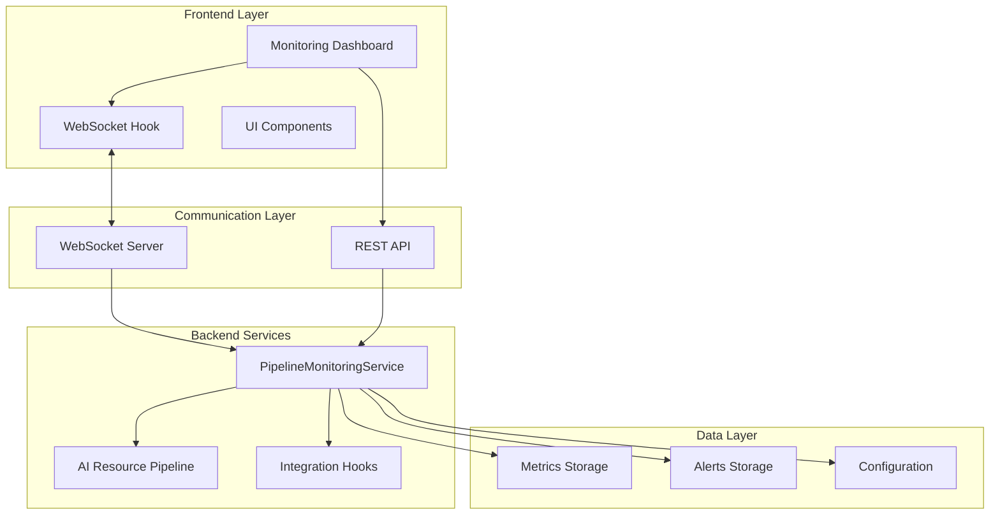
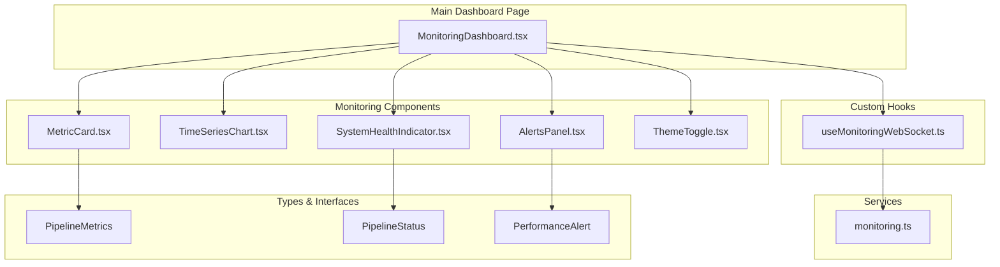
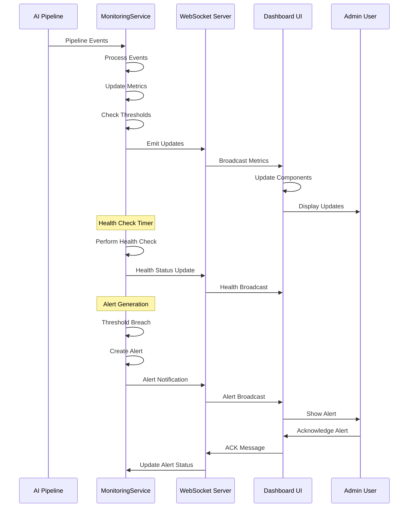
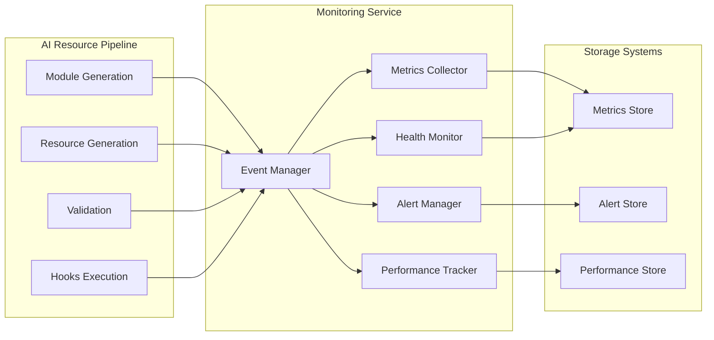
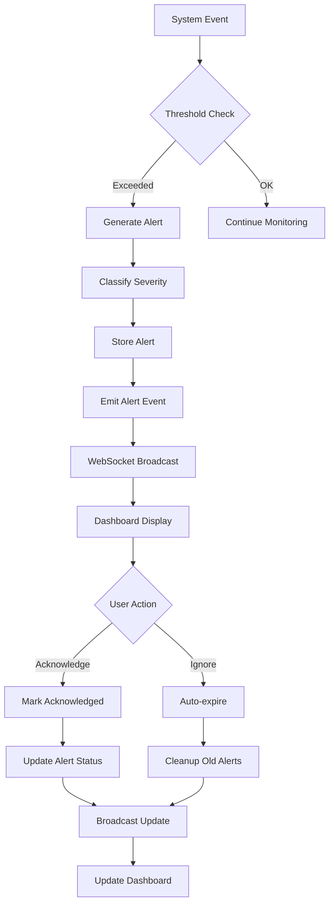
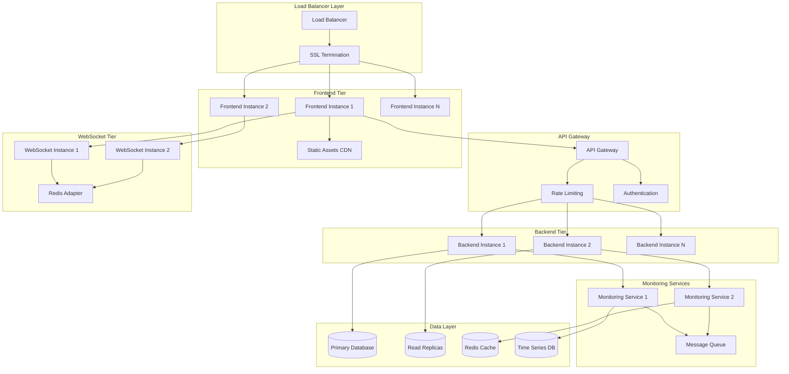
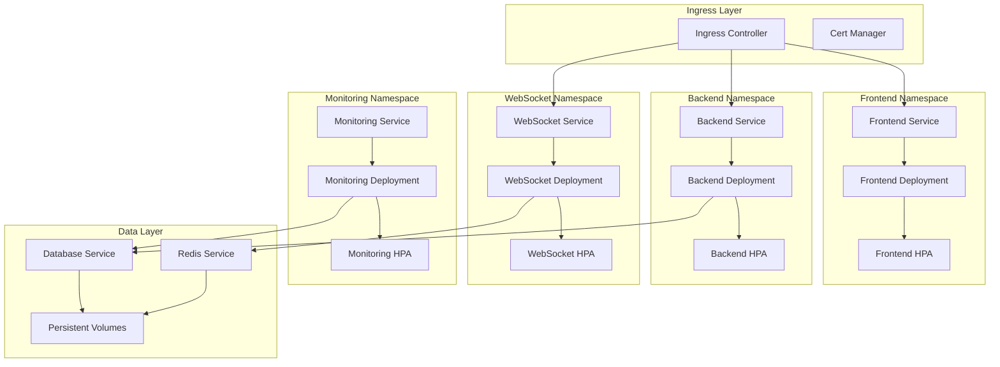
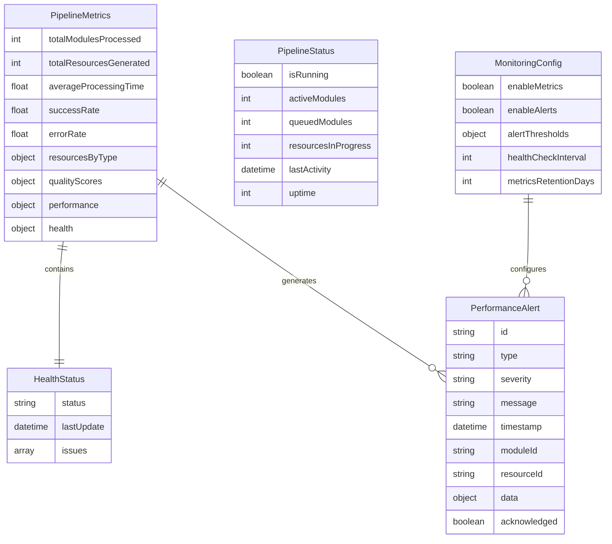
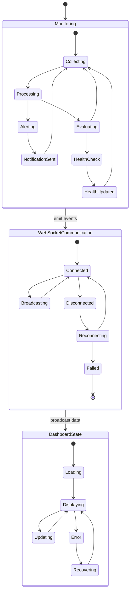

# Monitoring System Architecture Diagrams

## 1. High-Level System Architecture



## 2. Frontend Component Architecture



## 3. Data Flow Architecture



## 4. Backend Service Integration



## 5. WebSocket Communication Architecture

```mermaid
graph TB
    subgraph "Frontend Clients"
        C1[Admin User 1]
        C2[Admin User 2]
        C3[Admin User N]
    end
    
    subgraph "WebSocket Layer"
        WS[WebSocket Server]
        CM[Connection Manager]
        EM[Event Multiplexer]
    end
    
    subgraph "Backend Services"
        MS[Monitoring Service]
        EE[Event Emitter]
    end
    
    C1 <--> WS
    C2 <--> WS
    C3 <--> WS
    WS --> CM
    WS --> EM
    EM <--> EE
    EE <--> MS
    
    MS --> EE: metrics_update
    MS --> EE: status_update
    MS --> EE: alerts_update
    MS --> EE: health_check_complete
```

## 6. Alert Management Flow



## 7. Deployment Architecture - Production



## 8. Container Orchestration - Kubernetes



## 9. Monitoring Data Model



## 10. Real-time Event Flow



These diagrams provide a comprehensive visual representation of the monitoring system architecture, covering all major components, data flows, and deployment strategies. Each diagram focuses on a specific aspect of the system to provide clear understanding of the overall architecture.