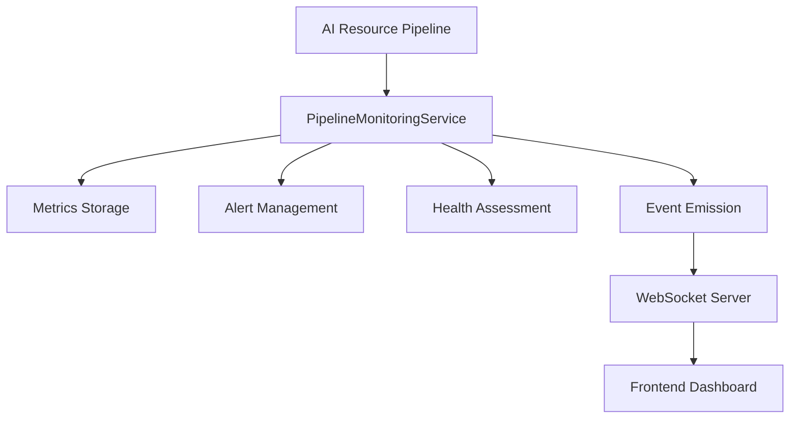
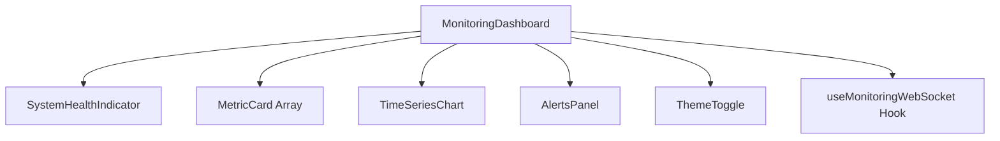

# Monitoring System Architecture - jaqEdu Platform

## Executive Summary

This document provides a comprehensive architectural overview of the monitoring system implemented for the jaqEdu educational platform. The system provides real-time monitoring, performance tracking, health checking, and alerting capabilities for the AI resource generation pipeline.

## System Overview

### Architecture Goals
- **Real-time Monitoring**: Provide instant visibility into system performance
- **Scalable Design**: Support horizontal and vertical scaling
- **High Availability**: Maintain monitoring even during system degradation
- **Comprehensive Coverage**: Monitor all critical system components
- **User-Friendly Interface**: Intuitive dashboard for administrators

### Key Principles
- Event-driven architecture for real-time updates
- Separation of concerns between monitoring logic and presentation
- Robust error handling and graceful degradation
- Extensible design for future monitoring requirements

## System Components

### 1. Backend Monitoring Services

#### 1.1 PipelineMonitoringService
**Location**: `/src/services/resourcePipeline/monitoring.ts`

**Responsibilities**:
- Collects metrics from the AI resource pipeline
- Tracks system health and performance
- Generates alerts based on configurable thresholds
- Manages performance data retention
- Provides real-time event emission

**Key Features**:
- **Metrics Collection**: Tracks 15+ key performance indicators
- **Health Monitoring**: Continuous system health assessment
- **Alert Management**: Configurable threshold-based alerting
- **Performance Tracking**: Detailed timing and resource usage metrics
- **Event Emission**: Real-time notifications via EventEmitter

**Configuration**:
```typescript
interface MonitoringConfig {
  enableMetrics: boolean;
  enableAlerts: boolean;
  enablePerformanceTracking: boolean;
  enableQualityTracking: boolean;
  enableHealthChecks: boolean;
  metricsRetentionDays: number;
  alertThresholds: {
    errorRate: number;
    averageProcessingTime: number;
    lowQualityScore: number;
    highMemoryUsage: number;
  };
  healthCheckInterval: number;
}
```

#### 1.2 Pipeline Integration
**Location**: `/src/services/resourcePipeline/pipeline.ts`

**Integration Points**:
- Module creation events
- Resource generation tracking
- Validation completion monitoring
- Error handling and reporting

### 2. Frontend Dashboard Components

#### 2.1 Main Dashboard
**Location**: `/src/pages/MonitoringDashboard.tsx`

**Features**:
- Real-time metrics visualization
- System health overview
- Dark/light theme support
- WebSocket integration
- Responsive grid layout
- Time series charts
- Resource distribution visualization

#### 2.2 UI Components

##### MetricCard Component
**Purpose**: Display key performance indicators
**Features**: Configurable colors, trend indicators, theme support

##### TimeSeriesChart Component
**Purpose**: Real-time metrics visualization
**Technology**: Recharts library
**Features**: Multiple data series, interactive tooltips, responsive design

##### SystemHealthIndicator Component
**Purpose**: Overall system health status
**Features**: Health status visualization, issue tracking, uptime indicators

##### AlertsPanel Component
**Purpose**: Alert management interface
**Features**: Alert filtering, acknowledgment, severity-based display

##### ThemeToggle Component
**Purpose**: Theme switching functionality
**Features**: Smooth transitions, persistent preferences

### 3. Real-time Communication

#### 3.1 WebSocket Integration
**Location**: `/src/hooks/useMonitoringWebSocket.ts`

**Features**:
- Auto-reconnection logic
- Mock data fallback
- Event-driven updates
- Error handling
- Connection status monitoring

**WebSocket Events**:
- `metrics_update`: Real-time metrics data
- `status_update`: System status changes
- `alerts_update`: Alert notifications
- `health_check_complete`: Health check results
- `request_initial_data`: Bootstrap data request
- `acknowledge_alert`: Alert acknowledgment

## Data Flow Architecture

### 1. Monitoring Data Collection Flow

```
AI Pipeline → PipelineMonitoringService → Event Emission → WebSocket Server → Frontend Dashboard
     ↓                    ↓                    ↓              ↓              ↓
Module Events      Metrics Processing    Real-time Events   Data Broadcasting  UI Updates
```

### 2. Alert Flow

```
Threshold Breach → Alert Generation → Alert Storage → WebSocket Broadcast → Dashboard Notification
      ↓                 ↓               ↓              ↓                  ↓
   Detection      Alert Creation    Alert Queue    Real-time Push    User Interface
```

### 3. Health Check Flow

```
Scheduled Health Check → System Assessment → Status Update → Dashboard Refresh
         ↓                      ↓              ↓              ↓
   Periodic Timer        Health Evaluation   Status Broadcast   UI Update
```

## Component Interactions

### 1. Backend Component Integration



### 2. Frontend Component Hierarchy



## Integration Points with Main Application

### 1. Authentication Integration
- **Route Protection**: Admin-only access to monitoring dashboard
- **Role-Based Access**: Integration with existing auth system
- **Session Management**: Leverages existing user session handling

### 2. Navigation Integration
- **Menu Item**: "Monitoramento" link in admin navigation
- **Icon**: Activity icon from Lucide React
- **Route**: Protected `/monitoring` route

### 3. Service Layer Integration
- **Pipeline Events**: Direct integration with AI resource pipeline
- **Error Handling**: Unified error reporting system
- **Configuration**: Uses existing config management patterns

### 4. Database Integration
- **Metrics Storage**: Optional persistent storage for historical data
- **User Preferences**: Theme and dashboard preferences storage
- **Alert History**: Long-term alert record keeping

## Deployment Architecture

### 1. Development Environment

```
Frontend (React) ←→ Backend (Node.js) ←→ WebSocket Server ←→ Monitoring Service
     ↓                    ↓                    ↓                    ↓
  Port 3000         Port 3000 (API)      Port 3001          In-Process
```

### 2. Production Environment

```
Load Balancer ←→ Frontend Cluster ←→ API Gateway ←→ Backend Cluster
      ↓              ↓                   ↓              ↓
   SSL/TLS      React Static Files    Rate Limiting   Node.js Apps
                                          ↓              ↓
                                    WebSocket LB ←→ WS Cluster
                                          ↓              ↓
                                   Connection Mgmt  Monitoring Services
```

### 3. Container Architecture

```yaml
# Docker Compose Structure
services:
  frontend:
    image: jaquedu/frontend
    ports: ["3000:80"]
    environment:
      - REACT_APP_WEBSOCKET_URL=ws://websocket:3001
    
  backend:
    image: jaquedu/backend
    ports: ["3000:3000"]
    environment:
      - MONITORING_ENABLED=true
      - WEBSOCKET_PORT=3001
    
  websocket:
    image: jaquedu/websocket-server
    ports: ["3001:3001"]
    depends_on: [backend]
    
  monitoring:
    image: jaquedu/monitoring-service
    depends_on: [backend, websocket]
```

## Scaling Strategies

### 1. Horizontal Scaling

#### Frontend Scaling
- **Static Asset CDN**: Serve React assets via CDN
- **Load Balancing**: Multiple frontend instances behind load balancer
- **Geographic Distribution**: Regional deployment for global access

#### Backend Scaling
- **Microservice Separation**: Extract monitoring service as separate microservice
- **Database Read Replicas**: Scale read operations for metrics queries
- **Message Queuing**: Use Redis/RabbitMQ for alert processing

#### WebSocket Scaling
- **Socket.IO Clustering**: Redis adapter for multi-instance WebSocket
- **Connection Load Balancing**: Sticky session support
- **WebSocket Gateways**: Dedicated WebSocket proxy layer

### 2. Vertical Scaling

#### Resource Optimization
- **Memory Management**: Efficient metrics data structures
- **CPU Optimization**: Async processing for heavy computations
- **Storage Optimization**: Time-series data compression

#### Performance Tuning
- **Caching Strategy**: Redis caching for frequently accessed metrics
- **Query Optimization**: Efficient database queries for historical data
- **Data Aggregation**: Pre-computed metrics for dashboard performance

### 3. Auto-Scaling Configuration

```yaml
# Kubernetes HPA Example
apiVersion: autoscaling/v2
kind: HorizontalPodAutoscaler
metadata:
  name: monitoring-dashboard-hpa
spec:
  scaleTargetRef:
    apiVersion: apps/v1
    kind: Deployment
    name: monitoring-dashboard
  minReplicas: 2
  maxReplicas: 10
  metrics:
  - type: Resource
    resource:
      name: cpu
      target:
        type: Utilization
        averageUtilization: 70
  - type: Resource
    resource:
      name: memory
      target:
        type: Utilization
        averageUtilization: 80
```

## Performance and Reliability Requirements

### 1. Performance Requirements

#### Response Time Targets
- **Dashboard Load**: < 2 seconds initial load
- **Real-time Updates**: < 100ms latency
- **Metric Queries**: < 500ms for complex queries
- **Alert Processing**: < 1 second from detection to notification

#### Throughput Requirements
- **Concurrent Users**: Support 100+ concurrent admin users
- **Events Per Second**: Handle 1000+ monitoring events/second
- **WebSocket Connections**: Support 500+ concurrent connections
- **Data Points**: Process 10,000+ metrics per minute

### 2. Reliability Requirements

#### Availability Targets
- **System Uptime**: 99.9% availability (8.76 hours downtime/year)
- **Monitoring Accuracy**: 99.99% accurate event capture
- **Data Retention**: 30 days default, configurable up to 1 year
- **Alert Delivery**: 99.9% successful alert delivery rate

#### Fault Tolerance
- **Graceful Degradation**: Continue operation with reduced functionality
- **Auto-Recovery**: Automatic service restart on failure
- **Circuit Breakers**: Prevent cascade failures
- **Backup Systems**: Fallback to cached/mock data

### 3. Scalability Requirements

#### Growth Projections
- **User Growth**: Support 10x user growth over 2 years
- **Data Growth**: Handle 100x increase in monitoring data
- **Geographic Expansion**: Multi-region deployment capability
- **Feature Expansion**: Modular architecture for new monitoring features

## Security Considerations

### 1. Access Control
- **Role-Based Access**: Admin-only dashboard access
- **API Security**: JWT token validation for WebSocket connections
- **Rate Limiting**: Prevent abuse of monitoring endpoints
- **Audit Logging**: Track administrative actions

### 2. Data Protection
- **Data Encryption**: Encrypt sensitive metrics data
- **Secure Transport**: TLS/SSL for all communications
- **Data Anonymization**: Remove PII from monitoring data
- **Retention Policies**: Automatic data purging based on retention rules

### 3. Infrastructure Security
- **Network Segmentation**: Isolate monitoring infrastructure
- **Container Security**: Secure container images and runtime
- **Secrets Management**: Secure storage of configuration secrets
- **Regular Updates**: Keep monitoring dependencies updated

## Future Enhancements

### 1. Advanced Analytics
- **Machine Learning**: Predictive analytics for system issues
- **Anomaly Detection**: Automated detection of unusual patterns
- **Capacity Planning**: Resource usage forecasting
- **Performance Optimization**: AI-driven performance recommendations

### 2. Extended Monitoring
- **User Experience Monitoring**: Track user interaction metrics
- **Business Metrics**: Monitor educational outcome metrics
- **Infrastructure Monitoring**: Server and network monitoring
- **Security Monitoring**: Security event tracking and analysis

### 3. Enhanced Alerting
- **Smart Alerting**: Context-aware alert prioritization
- **Multi-Channel Notifications**: Email, SMS, Slack integration
- **Alert Correlation**: Related alert grouping and analysis
- **Escalation Policies**: Automated alert escalation workflows

### 4. Improved Visualization
- **Custom Dashboards**: User-configurable dashboard layouts
- **Advanced Charts**: Additional chart types and visualizations
- **Report Generation**: Automated performance reports
- **Data Export**: CSV/JSON export capabilities

## Conclusion

The monitoring system architecture provides a robust, scalable foundation for system observability in the jaqEdu platform. The event-driven design ensures real-time visibility while maintaining performance and reliability. The modular architecture supports future enhancements and scaling requirements.

Key strengths of the current architecture:
- **Real-time capabilities** through WebSocket integration
- **Comprehensive monitoring** of the AI pipeline
- **User-friendly interface** with responsive design
- **Scalable design** supporting horizontal and vertical scaling
- **Robust error handling** with graceful degradation

The architecture is well-positioned to support the platform's growth and evolving monitoring requirements while maintaining high performance and reliability standards.