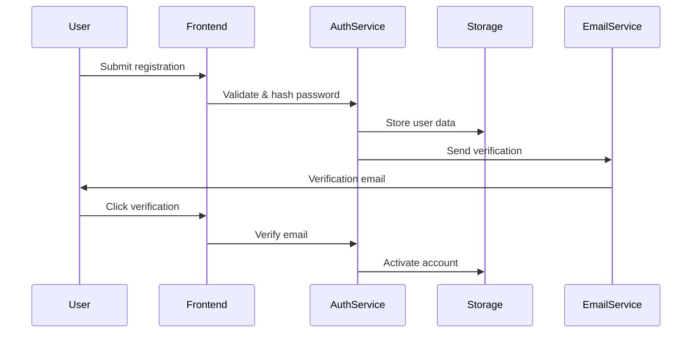
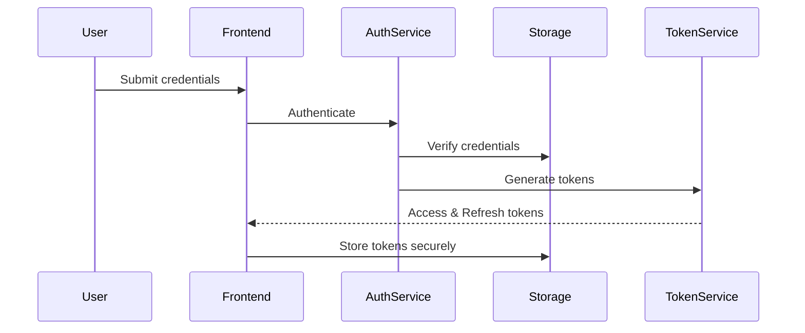

# Authentication System Architecture Design

## Overview
Comprehensive authentication and authorization system for jaqEdu platform supporting multiple user roles, secure sessions, and granular permissions.

## User Roles & Permissions

### Role Hierarchy
```typescript
enum UserRole {
  SUPER_ADMIN = 'super_admin',    // Full system access
  ADMIN = 'admin',                // Content management
  INSTRUCTOR = 'instructor',      // Create/manage courses
  STUDENT = 'student',           // Access courses
  GUEST = 'guest'                // Limited read-only access
}
```

### Permission Model
```typescript
interface Permission {
  resource: ResourceType;
  actions: Action[];
  conditions?: PermissionCondition[];
}

enum ResourceType {
  MODULE = 'module',
  QUIZ = 'quiz',
  NOTES = 'notes',
  ANALYTICS = 'analytics',
  USER = 'user',
  SYSTEM = 'system'
}

enum Action {
  CREATE = 'create',
  READ = 'read',
  UPDATE = 'update',
  DELETE = 'delete',
  PUBLISH = 'publish',
  SHARE = 'share'
}
```

## Authentication Flow

### 1. Registration Flow


### 2. Login Flow with JWT


## Security Architecture

### Password Security
```typescript
interface PasswordConfig {
  minLength: 12;
  requireUppercase: true;
  requireLowercase: true;
  requireNumbers: true;
  requireSpecialChars: true;
  preventCommonPasswords: true;
  preventUserInfo: true;
  historyCount: 5;
}

// Using bcrypt with proper cost factor
const BCRYPT_ROUNDS = 12;
```

### JWT Token Structure
```typescript
interface AccessTokenPayload {
  sub: string;           // User ID
  email: string;
  role: UserRole;
  permissions: Permission[];
  exp: number;           // 15 minutes
  iat: number;
  jti: string;          // Unique token ID
}

interface RefreshTokenPayload {
  sub: string;
  exp: number;          // 30 days
  iat: number;
  jti: string;
  family: string;       // Token family for rotation
}
```

### Session Management
```typescript
interface Session {
  id: string;
  userId: string;
  deviceId: string;
  ipAddress: string;
  userAgent: string;
  createdAt: Date;
  lastActivity: Date;
  expiresAt: Date;
  isActive: boolean;
}

interface SessionConfig {
  absoluteTimeout: 24 * 60 * 60 * 1000;  // 24 hours
  idleTimeout: 30 * 60 * 1000;           // 30 minutes
  maxConcurrentSessions: 3;
  enableDeviceTracking: true;
}
```

## Security Features

### 1. Rate Limiting
```typescript
interface RateLimitConfig {
  login: {
    windowMs: 15 * 60 * 1000,  // 15 minutes
    maxAttempts: 5,
    blockDuration: 30 * 60 * 1000  // 30 minutes
  },
  registration: {
    windowMs: 60 * 60 * 1000,  // 1 hour
    maxAttempts: 3
  },
  passwordReset: {
    windowMs: 60 * 60 * 1000,  // 1 hour
    maxAttempts: 3
  }
}
```

### 2. Security Headers
```typescript
const securityHeaders = {
  'X-Content-Type-Options': 'nosniff',
  'X-Frame-Options': 'DENY',
  'X-XSS-Protection': '1; mode=block',
  'Strict-Transport-Security': 'max-age=31536000; includeSubDomains',
  'Content-Security-Policy': "default-src 'self'",
  'Referrer-Policy': 'strict-origin-when-cross-origin'
};
```

### 3. CSRF Protection
- Double-submit cookie pattern
- Custom headers validation
- Origin/Referer checking

### 4. Account Security
- Two-factor authentication (TOTP)
- Account lockout after failed attempts
- Suspicious activity detection
- Device fingerprinting
- Login notifications

## Data Storage Schema

### User Model
```typescript
interface User {
  id: string;
  email: string;
  username: string;
  passwordHash: string;
  salt: string;
  role: UserRole;
  profile: UserProfile;
  security: SecuritySettings;
  createdAt: Date;
  updatedAt: Date;
  lastLogin: Date;
  isActive: boolean;
  isVerified: boolean;
}

interface UserProfile {
  firstName: string;
  lastName: string;
  avatar?: string;
  bio?: string;
  preferences: UserPreferences;
}

interface SecuritySettings {
  twoFactorEnabled: boolean;
  twoFactorSecret?: string;
  passwordHistory: string[];
  lastPasswordChange: Date;
  loginNotifications: boolean;
  trustedDevices: string[];
}
```

## API Endpoints

### Authentication Endpoints
```
POST   /api/auth/register
POST   /api/auth/login
POST   /api/auth/logout
POST   /api/auth/refresh
POST   /api/auth/verify-email
POST   /api/auth/forgot-password
POST   /api/auth/reset-password
GET    /api/auth/me
PUT    /api/auth/change-password
POST   /api/auth/enable-2fa
POST   /api/auth/verify-2fa
DELETE /api/auth/sessions/:id
```

### User Management Endpoints
```
GET    /api/users
GET    /api/users/:id
PUT    /api/users/:id
DELETE /api/users/:id
GET    /api/users/:id/permissions
PUT    /api/users/:id/role
GET    /api/users/:id/activity
```

## Migration Strategy

### Phase 1: Foundation (Week 1-2)
1. Implement secure password hashing service
2. Create JWT token management
3. Build user model and storage
4. Implement basic registration/login

### Phase 2: Security (Week 3-4)
1. Add rate limiting
2. Implement session management
3. Add CSRF protection
4. Implement 2FA

### Phase 3: RBAC (Week 5-6)
1. Define permission system
2. Implement role-based middleware
3. Update all routes with permissions
4. Create permission management UI

### Phase 4: Migration (Week 7-8)
1. Create admin user migration tool
2. Update existing localStorage data
3. Implement backward compatibility
4. Gradual rollout with feature flags

## Implementation Priority

1. **Critical Security** (Immediate)
   - Replace weak hashing with bcrypt
   - Implement proper JWT with signatures
   - Add rate limiting

2. **Core Features** (Week 1-2)
   - User registration
   - Secure login/logout
   - Password reset

3. **Enhanced Security** (Week 3-4)
   - 2FA implementation
   - Session management
   - Activity logging

4. **Advanced Features** (Week 5-6)
   - Full RBAC system
   - User management
   - Analytics dashboard

## Testing Strategy

### Security Testing
- Password strength validation
- Token expiration handling
- Rate limit effectiveness
- Session hijacking prevention
- XSS/CSRF protection
- SQL injection prevention

### Integration Testing
- Full authentication flows
- Permission checking
- Multi-device sessions
- Token refresh scenarios
- Account recovery flows

### Performance Testing
- Login response times
- Token validation speed
- Concurrent user handling
- Database query optimization